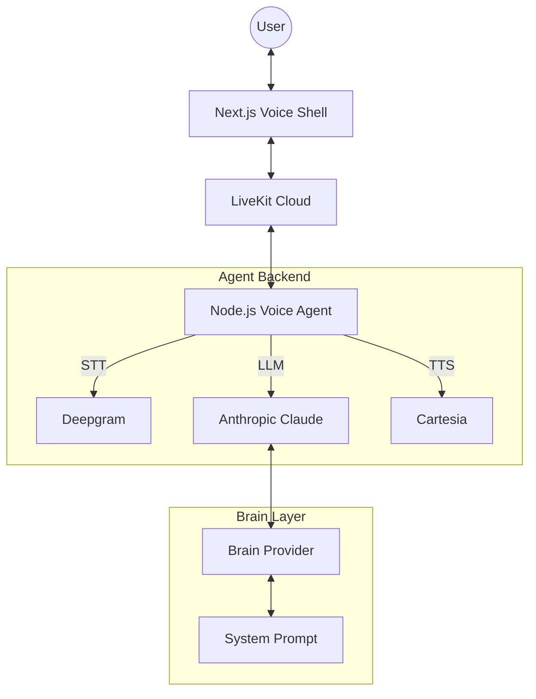

# Mentera Voice Platform POC Architecture

This document outlines the modular architecture of the Mentera Voice Platform Proof of Concept (Phase 1).

## 🏗️ Overall Architecture

The system follows a modular "Brain + Shell" design, separating the AI logic from the user interface and voice processing pipeline.



## 🛠️ Global Technology Stack

| Layer | Service | Purpose |
| :--- | :--- | :--- |
| **Connection** | [LiveKit](https://livekit.io) | Core RTC engine for room management and real-time audio/data streaming. |
| **STT** | [Deepgram](https://deepgram.com) | High-speed, low-latency Speech-to-Text for transcribing user input. |
| **TTS** | [Cartesia](https://cartesia.ai) | Ultra-premium, low-latency Text-to-Speech for Tera's voice output. |
| **LLM (Brain)** | [Anthropic](https://anthropic.com) | Claude 3.5 Sonnet / Haiku for conversational intelligence and dental scheduling logic. |
| **Frontend** | [Next.js](https://nextjs.org) | Premium React-based voice UI with animated orbs and live transcriptions. |
| **Agent Framework** | [@livekit/agents](https://github.com/livekit/agents-node) | Orchestration layer for the voice pipeline. |

## 🧠 Brain Implementation
The "Brain" is abstracted via the `BrainProvider` interface (see `brain/types.ts`). This allows us to swap the underlying LLM or logic without touching the Voice Shell or Agent code.

- **Tera System Prompt**: Located in `brain/prompt.ts`, containing the core dental assistant personality and scheduling rules.
- **Voice Optimization**: We use a specific `VOICE_PROMPT` to ensure Claude speaks in short, conversational sentences suitable for TTS, avoiding markdown and dense tables.

## 📡 LiveKit Integration
- **Frontend**: Uses `LiveKitRoom` and the `useVoiceAssistant` hook to connect to the room and interact with the agent.
- **Backend Agent**: Runs as a standalone Node.js process. It listens for room events from LiveKit Cloud and automatically joins to start the voice pipeline when a participant enters.

## 🚀 Running the Project

During development, you must run both the frontend and the agent backend simultaneously in separate terminal windows.

### 1. Start the Frontend Shell
The shell provides the user interface and initiates the LiveKit connection.
```bash
pnpm dev
```

### 2. Start the Voice Agent Backend
The agent handles the STT/LLM/TTS pipeline. Run this from the project root in a second terminal:
```bash
cd agent
npm run dev
```

## 🔐 Environment Variables
Required in `.env.local`:
- `LIVEKIT_API_KEY` / `LIVEKIT_API_SECRET`
- `NEXT_PUBLIC_LIVEKIT_URL`
- `DEEPGRAM_API_KEY`
- `CARTESIA_API_KEY`
- `ANTHROPIC_API_KEY`
