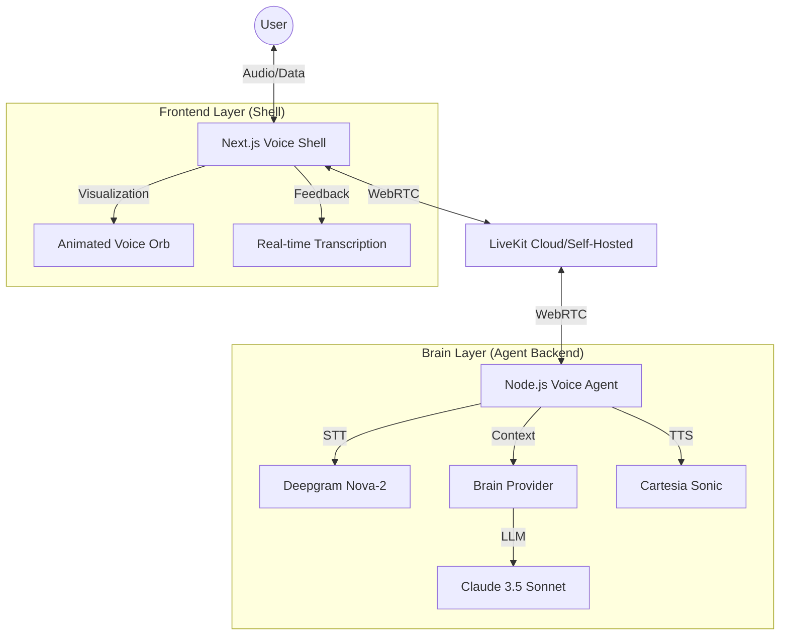

# 🏗️ Tera AI: System Architecture

This document describes the technical architecture of the Tera AI platform, a modular "Brain + Shell" system designed for high-performance voice interaction in dental practices.

---

## 🏗️ High-Level Architecture

The system is split into two primary domains: the **Shell** (Next.js Frontend) and the **Brain** (Node.js Agent + LLM). They communicate via **LiveKit**, which manages the real-time audio and data streams.

---

## 📡 The "Brain + Shell" Philosophy

1.  **The Shell (Frontend)**:
    - **Responsibility**: User Interface, microphone/speaker management, and visual feedback.
    - **Key Components**: 
        - `VoiceShell`: Orchestrates the LiveKit room session.
        - `VoiceOrb`: A Framer Motion-powered visualizer that reacts to agent states (idle, listening, thinking, speaking).
        - `TranscriptPanel`: Displays turn-based transcriptions for both the user and the agent.
    - **Transcription Sync**: The shell uses `useTrackTranscription` to display STT results and also listens to a `agent-transcript` data channel for early LLM token feedback.

2.  **The Brain (Agent)**:
    - **Responsibility**: Orchestrating the voice pipeline (Ear -> Mind -> Mouth).
    - **Key Components**:
        - `AnthropicLLM`: A custom implementation of the LiveKit Agents `LLM` class that integrates with our internal `BrainProvider`.
        - `VAD (Voice Activity Detection)`: Uses Silero VAD to accurately detect when the user starts and stops speaking.
        - `Streaming Pipeline`: Processes audio in chunks to ensure sub-second latency.

---

## 🎙️ The Voice Pipeline (Detailed)

The agent implements a sophisticated pipeline to ensure natural conversation and high reliability:

1.  **VAD (Silero)**: Constantly monitors the audio stream. When speech is detected, it triggers the STT and pauses any current agent speech (interruptibility).
2.  **STT (Deepgram)**: Transcribes user audio into text in real-time.
3.  **LLM (Anthropic + Custom Filtering)**:
    - The `AnthropicLLMStream` class handles the streaming response from Claude.
    - **Filter Logic**: A custom alphanumeric filter removes chunks containing only punctuation or markdown artifacts (e.g., `*`, `[`, `]`) before they reach the TTS engine. This prevents "empty transcript" errors in Cartesia.
    - **Buffering**: Punctuation is buffered and prepended to the next alphanumeric chunk for natural prosody.
4.  **TTS (Cartesia)**: Converts the filtered LLM text into high-quality audio.
5.  **Data Channel**: While the agent speaks, it simultaneously publishes tokens to the `agent-transcript` topic on the LiveKit data channel, allowing the UI to show what Tera is saying *before* the audio finishes.

---

## 🧠 Intelligence Layer

The `brain/` directory encapsulates the system's "personality" and logic:

- **`PromptBrain`**: The current implementation that uses static and dynamic prompts defined in `brain/prompt.ts`.
- **System Prompts**: 
    - `VOICE_PROMPT`: Optimized for spoken language (short sentences, no lists, emotional mirroring).
    - `DEFAULT_PROMPT`: Contains the core business logic, security boundaries, and demo data patterns for the dental/medical spa context.
- **Provider Pattern**: The architecture is designed to support multiple "brains" (e.g., swapping Claude for a RAG-based Bedrock Knowledge Base) by implementing the `BrainProvider` interface.

---

## 🛠️ Infrastructure & Deployment

- **LiveKit**: Acts as the central nervous system. The agent connects to LiveKit as a "Worker" and joins rooms dynamically when users connect.
- **Concurrency**: The project uses `concurrently` during development to run both the Next.js server and the Node.js agent.
- **Environment Management**: Secrets are managed via `.env` files, separated by the frontend (`.env.local`) and the agent backend (`agent/.env`).

---

## 🔐 Reliability & Safety

- **Resource Pre-loading**: The agent pre-loads the Silero VAD model and the system prompt on startup to avoid late-join timeouts.
- **Fallback Mechanisms**: If the LLM connection fails or is overloaded, the agent sends a pre-defined "trouble connecting" message to maintain user experience.
- **Security Boundaries**: System prompts include strict instructions to prevent prompt injection and character-breaking.
